# System Architecture Documentation

## **Overview**

This document describes the professional architecture of the **AI-Powered DevOps Incident Response System**, designed with **parallel multi-agent execution**, **CrewAI integration**, and **clean separation of concerns**.

## **Design Principles**

### **1. Separation of Concerns**
- **Core**: Configuration and state management
- **Agents**: Specialized business logic with CrewAI integration
- **Services**: External integrations (Gemini AI, Mock APIs)
- **Workflows**: Parallel orchestration logic
- **Utils**: Shared utilities and logging

### **2. Parallel Agent Execution**
- **Analysis agents** run simultaneously for 3x performance improvement
- **Decision agents** run sequentially based on analysis results
- **Graceful error handling** with partial results support

### **3. Interface Standardization**
- All agents inherit from `BaseIncidentAgent`
- Consistent async execution patterns
- Standardized error handling and logging

## **Directory Structure**

```
AI-Powered-DevOps-Incident-Response/
├── core/                    # Core system components
│   ├── __init__.py         # Package initialization
│   ├── config.py           # Environment-based configuration
│   └── state.py            # Incident state management
│
├── agents/                  # Specialized agent implementations
│   ├── __init__.py         # Package exports
│   ├── base_agent.py       # Abstract base class
│   ├── detective_agent.py  # Incident investigation
│   ├── diagnostics_agent.py# System health analysis
│   ├── historical_agent.py # Pattern matching
│   ├── remediation_agent.py# Automated resolution
│   ├── communication_agent.py# Stakeholder notifications
│   └── postmortem_agent.py # Documentation
│
├── services/                # External service integrations
│   ├── __init__.py         # Package initialization
│   ├── gemini/             # Gemini AI service
│   │   ├── __init__.py     # Service exports
│   │   └── client.py       # Custom LangChain wrapper
│   └── mock/               # Mock API service
│       ├── __init__.py     # Service exports
│       └── client.py       # Mock DevOps API client
│
├── workflows/               # Workflow orchestration
│   ├── __init__.py         # Package exports
│   └── parallel_workflow.py# Parallel execution logic
│
├── utils/                   # Utility functions
│   ├── __init__.py         # Package exports
│   └── logging_utils.py    # Logging configuration
│
├── .env.example             # Environment configuration template
├── .gitignore              # Git ignore rules
├── main.py                 # Application entry point
├── setup.py                # Automated setup script
├── test_system.py          # System validation tests
├── requirements.txt        # Python dependencies
├── README.md               # User documentation
└── ARCHITECTURE.md         # This file
```

## **Parallel Multi-Agent Workflow Diagram**

```mermaid
graph TD
    %% Entry Point
    START([🚀 Workflow Start]) --> INCIDENT_STATE[📋 Create Incident State]
    
    %% Incident State Creation
    INCIDENT_STATE --> |"Initialize State<br/>Generate Incident ID<br/>Set Timestamps"| PARALLEL{"🎯 Launch Parallel Agents"}
    
    %% TRUE Parallel Agent Execution
    PARALLEL --> |"Simultaneously"| DETECTIVE[🕵️ Detective Agent]
    PARALLEL --> |"Simultaneously"| DIAGNOSTICS[🔧 Diagnostics Agent]
    PARALLEL --> |"Simultaneously"| HISTORICAL[📚 Historical Agent]
    
    %% Agent Specializations
    DETECTIVE --> |"API Investigation<br/>Log Analysis<br/>Evidence Gathering"| DETECTIVE_RESULT[🕵️ Detective Results<br/>Confidence: 0.85<br/>Root Cause Analysis]
    
    DIAGNOSTICS --> |"System Health Check<br/>Resource Analysis<br/>Infrastructure Status"| DIAGNOSTICS_RESULT[🔧 Diagnostics Results<br/>Health Score: 0.65<br/>Component Status]
    
    HISTORICAL --> |"Pattern Matching<br/>Similar Incidents<br/>Solution History"| HISTORICAL_RESULT[📚 Historical Results<br/>Pattern Confidence: 0.75<br/>Past Solutions]
    
    %% Confidence Calculation
    DETECTIVE_RESULT --> CONFIDENCE[📈 Calculate Overall Confidence]
    DIAGNOSTICS_RESULT --> CONFIDENCE
    HISTORICAL_RESULT --> CONFIDENCE
    
    %% Sequential Decision Phase
    CONFIDENCE --> |"Overall: 0.72"| REMEDIATION[🤖 Remediation Agent]
    REMEDIATION --> |"Safety Analysis<br/>Action Planning<br/>Risk Assessment"| REMEDIATION_RESULT[🤖 Remediation Results<br/>Confidence: 0.70<br/>Action Plan]
    
    REMEDIATION_RESULT --> COMMUNICATION[📢 Communication Agent]
    COMMUNICATION --> |"Stakeholder Analysis<br/>Notification Strategy<br/>Message Planning"| COMMUNICATION_RESULT[📢 Communication Results<br/>Strategy: Defined<br/>Notifications: Ready]
    
    %% Decision Making
    COMMUNICATION_RESULT --> DECISION{"⚖️ Decision Maker<br/>Evaluate All Results"}
    
    %% Multi-Dimensional Decision Branching
    DECISION --> |"Overall Confidence ≥ 0.6<br/>Remediation Confidence ≥ 0.7<br/>Severity ≠ P0"| MITIGATE[⚡ Auto-Mitigation<br/>Execute Solution]
    DECISION --> |"Low Overall Confidence<br/>OR Low Remediation Confidence<br/>OR P0 Severity"| ESCALATE_DECISION[🔴 Escalation Decision<br/>Human Intervention]
    
    %% Mitigation Path
    MITIGATE --> |"Execute Remediation<br/>Monitor Progress<br/>Verify Success"| MIT_CHECK{"🔧 Mitigation<br/>Successful?"}
    MIT_CHECK --> |"Success"| RESOLVED[✅ Incident Resolved<br/>Auto-Recovery Complete]
    MIT_CHECK --> |"Failed"| ESCALATE_MIT[🔴 Escalation<br/>Mitigation Failed]
    
    %% Escalation Paths
    ESCALATE_DECISION --> ESCALATION[🚨 Human Escalation]
    ESCALATE_MIT --> ESCALATION
    
    %% Post-Resolution Analysis
    RESOLVED --> POSTMORTEM[📝 Post-Mortem Agent]
    POSTMORTEM --> |"Documentation<br/>Lessons Learned<br/>Prevention Measures"| POSTMORTEM_RESULT[📝 Post-Mortem Results<br/>Documentation: Complete<br/>Recommendations: Generated]
    
    %% Final Communication
    POSTMORTEM_RESULT --> COMM_SUCCESS[📧 Final Communication<br/>Success Report]
    ESCALATION --> COMM_ESCALATE[📧 Final Communication<br/>Escalation Report]
    
    %% Final States
    COMM_SUCCESS --> END_SUCCESS([🟢 RESOLVED<br/>Incident Auto-Resolved])
    COMM_ESCALATE --> END_ESCALATE([🔴 ESCALATED<br/>Human Intervention Required])
    
    %% Error Handling
    DETECTIVE --> |"Error"| ERROR[❌ Error Handler]
    DIAGNOSTICS --> |"Error"| ERROR
    HISTORICAL --> |"Error"| ERROR
    REMEDIATION --> |"Error"| ERROR
    COMMUNICATION --> |"Error"| ERROR
    POSTMORTEM --> |"Error"| ERROR
    MITIGATE --> |"Error"| ERROR
    ESCALATION --> |"Error"| ERROR
    ERROR --> END_ERROR([🔴 ERROR<br/>Graceful Degradation])
    
    %% Styling with Black Text
    classDef agentNode fill:#e1f5fe,stroke:#01579b,stroke-width:2px,color:#000000
    classDef resultNode fill:#f3e5f5,stroke:#4a148c,stroke-width:2px,color:#000000
    classDef decisionNode fill:#fff3e0,stroke:#e65100,stroke-width:2px,color:#000000
    classDef criticalNode fill:#ffebee,stroke:#c62828,stroke-width:3px,color:#000000
    classDef successNode fill:#e8f5e8,stroke:#2e7d32,stroke-width:2px,color:#000000
    classDef errorNode fill:#fce4ec,stroke:#ad1457,stroke-width:2px,color:#000000
    classDef stateNode fill:#fff9c4,stroke:#f57f17,stroke-width:1px,color:#000000
    classDef defaultNode fill:#f9f9f9,stroke:#333333,stroke-width:2px,color:#000000
    
    class DETECTIVE,DIAGNOSTICS,HISTORICAL,REMEDIATION,COMMUNICATION,POSTMORTEM,MITIGATE,ESCALATION agentNode
    class DETECTIVE_RESULT,DIAGNOSTICS_RESULT,HISTORICAL_RESULT,REMEDIATION_RESULT,COMMUNICATION_RESULT,POSTMORTEM_RESULT resultNode
    class DECISION,CHECK,MIT_CHECK decisionNode
    class ESCALATE_DECISION,ESCALATE_MIT,END_ESCALATE criticalNode
    class RESOLVED,COMM_SUCCESS,END_SUCCESS successNode
    class ERROR,END_ERROR errorNode
    class INCIDENT_STATE,CONFIDENCE stateNode
    class START,PARALLEL,COORD,SUMMARY,WAIT,COMM_ESCALATE defaultNode
```



## **Agent Architecture**

### **Parallel Execution Pattern**
```python
# Phase 1: TRUE Parallel Analysis (3 agents simultaneously)
detective_result, diagnostics_result, historical_result = await asyncio.gather(
    detective_agent.execute_async(state),
    diagnostics_agent.execute_async(state), 
    historical_agent.execute_async(state),
    return_exceptions=True  # Graceful error handling
)

# Phase 2: Sequential Decision Making (based on analysis results)
remediation_result = await remediation_agent.execute_async(state)
communication_result = await communication_agent.execute_async(state)
```

### **Agent Lifecycle**
1. **Initialization**: Agent created with specialized Gemini LLM
2. **Async Execution**: `execute_async()` method called with incident state
3. **AI Processing**: Agent-specific `analyze_async()` method with Gemini
4. **State Update**: Results merged into workflow state
5. **Error Handling**: Graceful degradation on failures

### **Error Handling Strategy**
- **Individual Agent Failures**: Workflow continues with partial results
- **Parallel Execution**: `return_exceptions=True` prevents single agent failure from stopping workflow
- **Graceful Degradation**: Default confidence scores used when agents fail
- **Comprehensive Logging**: All errors logged with context

## **Service Architecture**

### **Service Abstraction Layers**

#### **1. Gemini AI Service** (`services/gemini/`)
- **Custom LangChain Wrapper**: Specialized for incident response
- **Multiple LLM Configurations**: Different temperature settings per agent type
- **Streaming Responses**: Efficient token usage
- **Error Recovery**: Fallback responses on API failures

#### **2. Mock API Service** (`services/mock/`)
- **DevOps API Simulation**: Elasticsearch, Kubernetes, Prometheus, etc.
- **Realistic Data Generation**: Incident scenarios with proper complexity
- **Async API Calls**: Non-blocking external service calls
- **Error Simulation**: Realistic failure scenarios

### **Service Benefits**
- **Easy Testing**: Mock services for development
- **Consistent Interfaces**: Standardized API patterns
- **Error Resilience**: Graceful handling of service failures
- **Configuration Management**: Environment-based service configuration

## **State Management**

### **Incident State Flow**
1. **Initial State**: Created by `create_incident_state()`
2. **Agent Updates**: Each agent adds results via `add_agent_result()`
3. **Confidence Calculation**: `calculate_overall_confidence()` aggregates scores
4. **Decision Making**: State analyzed for auto-remediation vs escalation
5. **Final State**: Resolution or escalation with complete audit trail

### **State Structure**
```python
{
    # Core incident info
    "incident_id": "INC-20241220-ABC123",
    "affected_service": "payment-service",
    "incident_type": "database_timeout",
    "severity": "P2",
    "description": "Database connection timeouts",
    
    # Agent results
    "agent_analyses": {
        "detective": {"confidence": 0.85, "analysis": "..."},
        "diagnostics": {"health_score": 0.65, "analysis": "..."},
        "historical": {"pattern_confidence": 0.75, "analysis": "..."},
        "remediation": {"remediation_confidence": 0.70, "analysis": "..."},
        "communication": {"communication_confidence": 0.90, "analysis": "..."},
        "postmortem": {"documentation_confidence": 0.75, "analysis": "..."}
    },
    
    # Calculated metrics
    "overall_confidence": 0.72,
    
    # Resolution tracking
    "status": "resolved",
    "resolution_method": "parallel_auto_remediation",
    "resolution_time_minutes": 15,
    
    # Timestamps
    "created_at": "2024-12-20T10:30:00",
    "resolved_at": "2024-12-20T10:45:00"
}
```

## **Parallel Workflow Orchestration**

### **Performance Characteristics**

#### **Parallel vs Sequential Comparison**

| Metric | Sequential | Parallel | Improvement |
|--------|------------|----------|-------------|
| **Analysis Phase** | ~15-20 seconds | ~5-8 seconds | **3x faster** |
| **Total Workflow** | ~25-30 seconds | ~12-18 seconds | **50% faster** |
| **Agent Execution** | One by one | Simultaneous | **Concurrent** |
| **Resource Usage** | Linear | Parallel | **Efficient** |
| **Failure Impact** | Blocks workflow | Partial results | **Resilient** |

#### **Timing Breakdown**
```
Parallel Execution Flow:
├── Incident State Creation:    ~1 second
├── Parallel Analysis Phase:    ~5-8 seconds (max of all 3)
│   ├─ Detective Agent:         ~4-6 seconds
│   ├─ Diagnostics Agent:       ~3-5 seconds  
│   └─ Historical Agent:        ~2-4 seconds
├── Confidence Calculation:     ~0.5 seconds
├── Remediation Planning:       ~2-3 seconds
├── Communication Planning:     ~1-2 seconds
├── Decision Making:            ~0.5 seconds
├── Execution (Auto/Escalate):  ~2-3 seconds
└── Post-Mortem (if resolved):  ~2-3 seconds
─────────────────────────────────────────────
Total:                          ~12-18 seconds
```

### **Parallel Agent Specifications**

#### **Detective Agent**
- **Execution Time**: ~4-6 seconds
- **AI Integration**: Gemini 2.0 Flash with investigation prompts
- **Data Sources**: Mock API logs, metrics, system data
- **Output**: Confidence score (0.0-1.0), root cause analysis, evidence
- **Temperature**: 0.1 (precise analysis)

#### **Diagnostics Agent**
- **Execution Time**: ~3-5 seconds
- **AI Integration**: Gemini 2.0 Flash with system health prompts
- **Data Sources**: Kubernetes pods, Prometheus alerts, system metrics
- **Output**: Health score (0.0-1.0), resource analysis, bottlenecks
- **Temperature**: 0.05 (technical accuracy)

#### **Historical Agent**
- **Execution Time**: ~2-4 seconds
- **AI Integration**: Gemini 2.0 Flash with pattern matching prompts
- **Data Sources**: Jira incidents, PagerDuty history, similar patterns
- **Output**: Pattern confidence (0.0-1.0), similar incidents, solutions
- **Temperature**: 0.2 (pattern recognition)

## **Decision Making Logic**

### **Multi-Dimensional Decision Matrix**

| Condition | Overall Confidence | Remediation Confidence | Severity | Decision | Action |
|-----------|-------------------|------------------------|----------|----------|--------|
| **High Confidence** | ≥ 0.6 | ≥ 0.7 | P1, P2, P3 | **AUTO-REMEDIATE** | Execute Solution |
| **Low Overall** | < 0.6 | Any | Any | **ESCALATE** | Human Review |
| **Low Remediation** | ≥ 0.6 | < 0.7 | Any | **ESCALATE** | Uncertain Solution |
| **Critical Severity** | Any | Any | P0 | **ESCALATE** | Human Oversight |

### **Decision Algorithm**
```python
def should_auto_remediate(overall_confidence, remediation_confidence, severity):
    return (
        overall_confidence >= config.auto_remediation_confidence_threshold and
        remediation_confidence >= 0.7 and
        severity != 'P0'  # Never auto-remediate P0 incidents
    )
```

## **Security & Configuration**

### **Environment-Based Configuration**
- **`.env` file**: Secure credential storage
- **Environment variables**: Production deployment support
- **Configuration validation**: Startup checks with helpful error messages
- **API key protection**: Never hardcoded in source code

### **Required Configuration**
```bash
# .env file
GEMINI_API_KEY=your-gemini-api-key-here
GEMINI_MODEL=gemini-2.0-flash
AUTO_REMEDIATION_THRESHOLD=0.6
MAX_RETRIES=3
LOG_LEVEL=INFO
```

## **Scalability Design**

### **Horizontal Scaling**
- **Stateless agent design**: No persistent state between executions
- **Service abstraction**: Easy to replace mock APIs with real services
- **Configurable thresholds**: Adjustable for different environments

### **Vertical Scaling**
- **Parallel execution**: Better CPU utilization
- **Async operations**: Non-blocking I/O
- **Memory efficient**: Minimal state retention

### **Extension Points**
- **New agents**: Inherit from `BaseIncidentAgent`
- **Additional services**: Add to `services/` directory
- **Custom workflows**: Extend `workflows/` with new orchestration patterns

## **Testing Strategy**

### **System Testing**
```bash
# Comprehensive system test
python test_system.py

# Configuration validation
python main.py --config

# Individual component testing
python main.py --test
```

### **Test Coverage**
- **Configuration validation**: Environment variable checking
- **Gemini AI connection**: API connectivity and response validation
- **Mock API integration**: Service availability and data format
- **Individual agents**: Isolated agent functionality
- **Parallel workflow**: End-to-end workflow execution

## **Maintenance & Operations**

### **Logging Strategy**
- **Structured logging**: Consistent format across all components
- **Agent-specific namespaces**: Easy filtering and debugging
- **Configurable levels**: Development vs production logging
- **File and console output**: Comprehensive log capture

### **Monitoring Capabilities**
- **Workflow metrics**: Success rates, timing, confidence scores
- **Agent performance**: Individual agent execution times
- **Error tracking**: Comprehensive error logging and reporting
- **Configuration status**: Runtime configuration validation

### **Operational Commands**
```bash
# Check system health
python main.py --config

# Run system validation
python test_system.py

# Process incidents
python main.py "incident description"

# Interactive demo
python main.py --demo
```

## **Component Interactions**

### **1. Workflow Orchestration**
```
main.py → workflows/parallel_workflow.py → agents/* → services/*
```

### **2. Agent Execution Pattern**
```
BaseIncidentAgent.execute_async() → Agent.analyze_async() → Service calls → State update
```

### **3. Service Integration**
```
Agent → Service Client → External API/Mock → Response Processing → State Update
```

## **Architecture Benefits**

### **Performance**
- **3x faster analysis** through parallel agent execution
- **Efficient resource utilization** with async operations
- **Scalable design** for high-volume incident processing

### **Maintainability**
- **Clean separation of concerns** with modular design
- **Standardized interfaces** for consistent development
- **Comprehensive error handling** for reliability

### **Testability**
- **Service abstraction** for easy mocking
- **Individual agent testing** for isolated validation
- **End-to-end testing** for workflow verification

### **Production Readiness**
- **Environment-based configuration** for deployment flexibility
- **Comprehensive logging** for operational visibility
- **Graceful error handling** for system reliability
- **Security best practices** for credential management

---

This architecture provides a solid foundation for a production-ready incident response system with excellent performance, maintainability, and scalability characteristics.